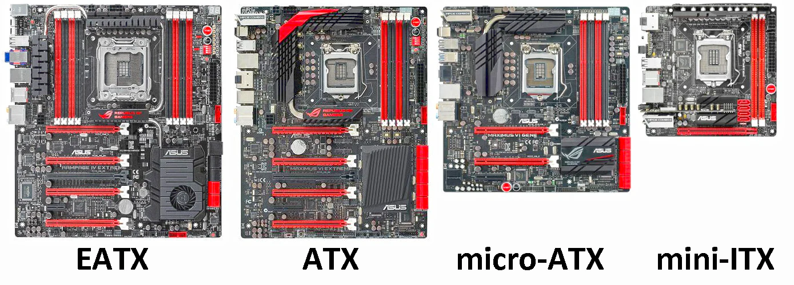
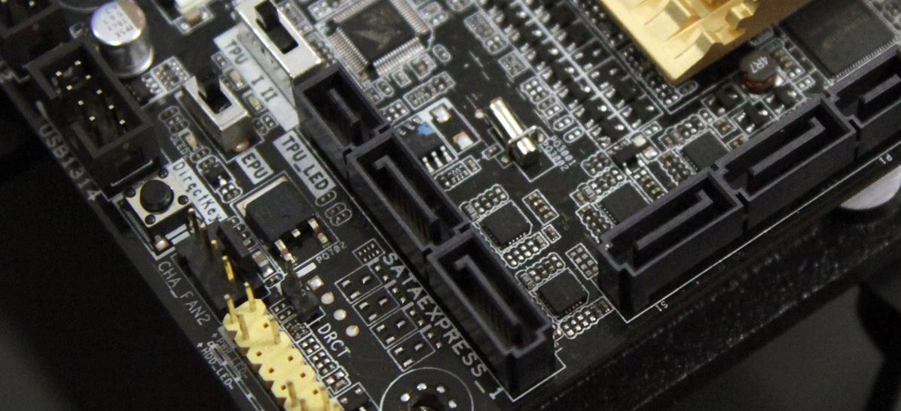
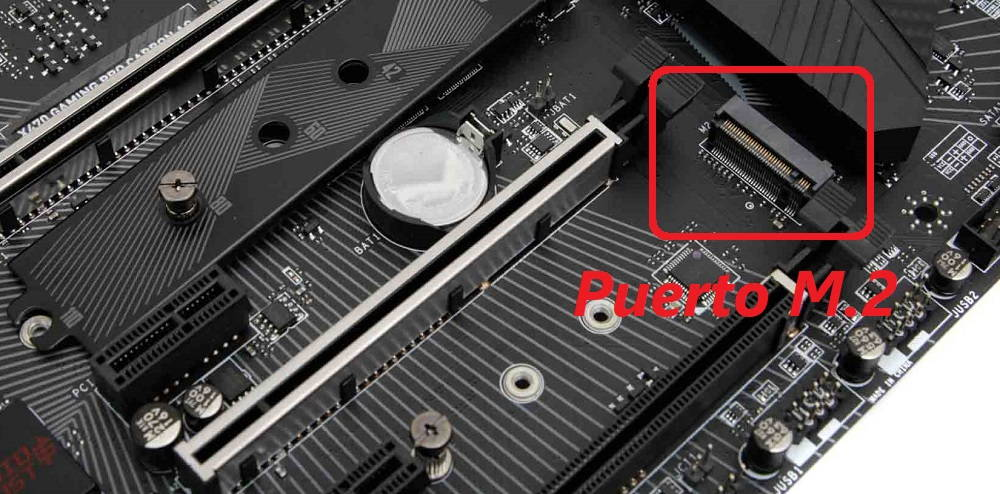

# Índice

## 📚 Mantenimiento y Montaje de Equipos Informáticos

## TEMA 2. COMPONENTES INTERNOS FUNDAMENTALES

- [0. **Definición y Función General (Placa base)**](#0-definición-y-función-general-placa-base)
- [1 **Vocabulario Fundamental**](#1-vocabulario-fundamental)
- [2. **Factor de forma**](#2-factor-de-forma)
  - [2.1 Concepto y importancia](#21-concepto-y-importancia)
  - [2.2 Factores de forma más utilizados (2025)](#22-factores-de-forma-más-utilizados-2025)
  - [2.3 Detalle de factores actuales](#23-detalle-de-factores-actuales)
  - [2.4 Tabla comparativa resumida](#24-tabla-comparativa-resumida)
  - [2.5 Recomendaciones](#25-recomendaciones)
- [3 **Chasis o Caja del pc**](#3-chasis-o-caja-del-pc)
  - [3.1 Partes principales modernas](#31-partes-principales-modernas)
  - [3.2 Factor de Forma y Tipos](#32-factor-de-forma-y-tipos)
  - [3.3 Paneles y cableado moderno](#33-paneles-y-cableado-moderno)
  - [3.4 Consejos prácticos](#34-consejos-prácticos)
- [4. **Conectores**](#4-conectores)
  - [4.1 Conectores Externos](#41-conectores-externos)
  - [4.2 Conectores Internos (Desarrollado y Ampliado)](#42-conectores-internos-desarrollado-y-ampliado)
    - [4.2.1   SATA III (Serial ATA Revisado)\*\*](#421---sata-iii-serial-ata-revisado)
    - [4.2.2   M.2 (Socket sobre placa base)\*\*](#422---m2-socket-sobre-placa-base)
    - [4.2.3  PCI Express (PCIe)](#423--pci-express-pcie)
    - [4.2.4  Conectores de Alimentación internos](#424--conectores-de-alimentación-internos)
    - [4.2.5 Headers para el panel frontal y periféricos](#425-headers-para-el-panel-frontal-y-periféricos)
    - [4.2.6 Otros conectores relevantes](#426-otros-conectores-relevantes)
- [5 **Zócalo del Procesador (Socket)**](#5-zócalo-del-procesador-socket)
  - [5.1. Tipos de Socket](#51-tipos-de-socket)
  - [5.2 Principales sockets modernos (2022–2025)](#52-principales-sockets-modernos-20222025)
- [6 **Chipset**](#6-chipset)
- [7 **Ranuras RAM y Arquitectura Multicanal**](#7-ranuras-ram-y-arquitectura-multicanal)
  - [7.1 Tipos de ranuras y módulos](#71-tipos-de-ranuras-y-módulos)
  - [7.2 Número de ranuras](#72-número-de-ranuras)
  - [7.3 Arquitectura de canales (Channel Architecture)](#73-arquitectura-de-canales-channel-architecture)
  - [7.4 Cómo aprovechar la arquitectura multicanal](#74-cómo-aprovechar-la-arquitectura-multicanal)
  - [7.5 Ejemplo de configuración óptima para gaming 2025](#75-ejemplo-de-configuración-óptima-para-gaming-2025)
  - [7.6 Consejos prácticos](#76-consejos-prácticos)
- [7.6 Consejos prácticos](#76-consejos-prácticos)
- [8. **Slots de expansión**](#8-slots-de-expansión)
- [8.1 El Bus PCI Express (PCIe): Funcionamiento y Estructura](#81-el-bus-pci-express-pcie-funcionamiento-y-estructura)
    - [8.1.1 Estructura y concepto de “líneas” (lanes):](#811-estructura-y-concepto-de-líneas-lanes)
    - [8.1.2 Ventajas técnicas de PCIe:](#812-ventajas-técnicas-de-pcie)
    - [8.1.3 Versiones PCIe y ancho de banda por línea:](#813-versiones-pcie-y-ancho-de-banda-por-línea)
    - [8.1.4 Cómo afecta al usuario:](#814-cómo-afecta-al-usuario)
    - [8.1.1 Estructura y concepto de "líneas" (lanes)](#811-estructura-y-concepto-de-líneas-lanes)
    - [8.1.2 Ventajas técnicas de PCIe](#812-ventajas-técnicas-de-pcie)
    - [8.1.3 Versiones PCIe y ancho de banda por línea](#813-versiones-pcie-y-ancho-de-banda-por-línea)
    - [8.1.4 Cómo afecta al usuario](#814-cómo-afecta-al-usuario)
- [8.1.5 Tipos físicos de slots y ejemplos de uso](#815-tipos-físicos-de-slots-y-ejemplos-de-uso)
- [8.2 M.2](#82-m2)
- [8.2.1 Ejemplo de configuración](#821-ejemplo-de-configuración)
- [8.2.2 Consejos técnicos y consideraciones](#822-consejos-técnicos-y-consideraciones)
- [9. **VRM (Voltage Regulator Module)**](#9-vrm-voltage-regulator-module)
- [9.1. Concepto y función esencial](#91-concepto-y-función-esencial)
  - [9.2.  Estructura de un VRM moderno](#92--estructura-de-un-vrm-moderno)
  - [9.2. Estructura de un VRM moderno](#92-estructura-de-un-vrm-moderno)
- [9.3. Importancia del VRM en 2025](#93-importancia-del-vrm-en-2025)
- [9.4. Número de fases y su relevancia](#94-número-de-fases-y-su-relevancia)
- [9.5. Consejos de usuario y técnico](#95-consejos-de-usuario-y-técnico)
- [10. **Nuevas tecnologías**](#10-nuevas-tecnologías)
- [11. **Instalación y mantenimiento**](#11-instalación-y-mantenimiento)

---

# 0. Definición y Función General (Placa base)

La **placa base** es la plataforma esencial donde se interconectan todos los componentes del ordenador: CPU, RAM, almacenamiento, tarjetas de expansión y periféricos. Determina compatibilidad, escalabilidad, rendimiento y posibilidades de actualización.

---

# 1 Vocabulario Fundamental

| **Término** | **Definición** |
|---------------------|----------------------------------|
| **Cuello de botella** | Limitación de rendimiento causada porque un componente (CPU, GPU, RAM, SSD) es más rápido que el resto de la cadena y la transmisión de datos se ve frenada; hoy afecta sobre todo a buses y almacenamiento en gaming de alta gama. |
| **Coma flotante**    | Notación para representar números reales con mucha precisión, clave en procesadores y sobre todo en IA moderna y tarjetas gráficas, que ahora realizan trillones de cálculos de coma flotante por segundo. |
| **Factor de forma**  | Estándar físico de placas base y chasis: ATX, MicroATX, MiniITX, y el nuevo BTF (Back To Front) en cableado oculto; las RAM CAMM2 empiezan a desplazar a SO-DIMM en portátiles. |
| **Coma flotante** | Notación para representar números reales con mucha precisión, clave en procesadores y sobre todo en IA moderna y tarjetas gráficas, que ahora realizan trillones de cálculos de coma flotante por segundo. |
| **Factor de forma** | Estándar físico de placas base y chasis: ATX, MicroATX, MiniITX, y el nuevo BTF (Back To Front) en cableado oculto; las RAM CAMM2 empiezan a desplazar a SO-DIMM en portátiles. |
| **Fan (ventilador)** | Elemento crítico de refrigeración. Ahora mayoría incluyen control digital (PWM), sensores de temperatura y efecto RGB sincronizable. |
| **FSB**              | Bus frontal ya obsoleto, sustituido hoy por buses PCIe, DMI (Intel) o Infinity Fabric (AMD). |
| **FSB** | Bus frontal ya obsoleto, sustituido hoy por buses PCIe, DMI (Intel) o Infinity Fabric (AMD). |
| **Gigahercio (GHz)** | Unidad de frecuencia. CPUs actuales alcanzan más de 5.5 GHz. RAM DDR5 para gaming puede correr a 8000+ MHz. |
| **Memoria flash**    | Base de SSDs NVMe y UltraRAM, que superan en velocidad a discos SATA convencionales. |
| **Nanosegundo**      | Tiempo mínimo de acceso en chips RAM y SSD. Hoy se dan valores de 7–12 ns en memorias premium. |
| **Nanómetro**        | Milmillonésima parte de un metro; hace referencia al proceso de fabricación de chips: 3nm y 4nm dominan en CPUs y GPUs actuales. |
| **Memoria flash** | Base de SSDs NVMe y UltraRAM, que superan en velocidad a discos SATA convencionales. |
| **Nanosegundo** | Tiempo mínimo de acceso en chips RAM y SSD. Hoy se dan valores de 7–12 ns en memorias premium. |
| **Nanómetro** | Milmillonésima parte de un metro; hace referencia al proceso de fabricación de chips: 3nm y 4nm dominan en CPUs y GPUs actuales. |

---

# 2. Factor de forma

El **factor de forma** define las dimensiones físicas, el diseño de los conectores y la organización interna de la placa base, lo que determina la compatibilidad con chasis, fuentes de alimentación y componentes. Elegir el adecuado afecta la capacidad de expansión, refrigeración, estética y futuro upgrade del sistema.

---
 

  

 

---

## 2.1 Concepto y importancia

- Un factor de forma es un estándar que dicta cómo se fabrican y disponen las placas base y sus componentes. Su objetivo es garantizar compatibilidad entre placas, torres y demás hardware modular.
- Afecta a:
- Número y tipo de ranuras de expansión (PCIe, M.2, RAM).
@@ -97,471 +65,13 @@ El **factor de forma** define las dimensiones físicas, el diseño de los conect
---

## 2.2 Factores de forma más utilizados (2025)
| Factor de forma   | Dimensiones (mm) | Puestos de expansión | Uso principal                | Compatibilidad chasis      |
|-------------------|------------------|----------------------|------------------------------|----------------------------|
| ATX               | 305 x 244        | 7 PCIe + 4–8 RAM     | Gaming, workstation, desktop | Universal                  |
| MicroATX          | 244 x 244        | 4 PCIe + 2–4 RAM     | Oficina, gaming compactos    | ATX/MicroATX               |
| MiniITX           | 170 x 170        | 1 PCIe + 2 RAM       | HTPC, ultracompactos, SFF    | Mini/micro ATX, ITX        |
| E-ATX             | 305 x 330        | 8 PCIe + 8 RAM       | Workstation, gaming extremo  | Full Tower, E-ATX          |
| XL-ATX            | Hasta 345 x 262  | 8+ PCIe + 8+ RAM     | Servidor         | Full Tower XL, server rack |
| DTX/Mini-DTX      | 203 x 244/170x203| 2 PCIe + 2 RAM       | SFF, embebidos, industria    | Mini/Micro ATX, DTX        |
| BTF/Back Connect  | Variable         | Mismas que ATX/ITX   | PC moderno cableado limpio   | Chasis BTF homologados     |
| CAMM2             | N/A (RAM modular)| —                    | Portátiles premium, SFF      | Cajas y disipadores específicos |

---

## 2.3 Detalle de factores actuales
**ATX:**  
El estándar dominante: admite sistemas exigentes de gaming y trabajo, multiGPU, muchas unidades M.2/SATA y RAM. Excelente ventilación.

**MicroATX:**  
Más compacto, ideal para equipos medios y oficinas; se puede instalar en cajas ATX. Permite menos expansión pero suficiente para la mayoría de usuarios.

**MiniITX:**  
El más pequeño en desktop. Ideal en builds minimalistas, HTPC y setups compactos. Limitación clara de expansión y refrigeración.

**E-ATX / XL-ATX:**  
Formato grande: más ranuras y espacio para refrigeración extrema, ideal para workstations, creadores, servidores domésticos.

**DTX / MiniDTX / NanoITX / PicoITX:**  
Formatos industriales y embebidos. Usados en IoT, robótica, aplicaciones custom. Limitación absoluta de expansión.

**BTF/Back Connect:**  
Concepto moderno donde el cableado va oculto en el reverso de la placa, facilitando airflow, limpieza visual y builds “premium”.

**CAMM2:**  
Solo para portátiles premium y workstations compactas. Permite módulos de RAM plug&play, máxima densidad y fácil instalación.

**Formato propietario:**  
Usado en OEM y all-in-one, dificultad de actualización e intercambios.

---

## 2.4 Tabla comparativa resumida
| Nombre     | Expansión Máx. | Dimensiones | Uso                       | Expansibilidad |
|------------|----------------|-------------|---------------------------|----------------|
| ATX        | Alta           | 305x244     | Gaming general, workstation| Muy alta        |
| MicroATX   | Media          | 244x244     | Oficina, gaming compacto  | Alta            |
| MiniITX    | Baja           | 170x170     | SFF, media center         | Media           |
| E-ATX      | Muy alta       | 305x330     | Workstation, multi-GPU    | Máxima          |
| BTF        | Variable       | Variable    | Builds cableado premium   | Muy alta        |
| CAMM2      | —              | —           | Portátiles premium        | Modular RAM     |

---

## 2.5 Recomendaciones
- Para gaming y workstation: ATX, E-ATX o BTF si buscas máxima capacidad y estética.
- Para oficinas o PCs compactos: MicroATX o MiniITX.
- Para portátiles o máquinas plug&play: verifica compatibilidad CAMM2 para upgrades futuros.
- Evita formatos propietarios salvo equipos OEM o necesidades muy específicas.

---

# 3 Chasis o Caja del pc
## 3.1 Partes principales modernas
- **Cubierta**: Acero galvanizado, paneles laterales de cristal templado, sistemas magnéticos y modulares.
- **Panel frontal**: Botones táctiles, displays LCD/AMOLED (monitoreo en tiempo real), puertos USB-C, USB 4.0, salida/entrada audio, pantalla de temperatura y carga.
- **Bahías internas**: Principalmente slots M.2 y 2.5"/3.5" (con tendencia a M.2). Las bahías externas (5,25") van desapareciendo.
- **Fuente alimentación**: Zona separada, formato ATX 3.0/SFX-L, modulable y con soporte para GPU PCIe 5.0.

## 3.2 Factor de Forma y Tipos
| Tipo                  | Fit/Expansión        | Ventajas                  | Limitaciones/Contexto                    |
|-----------------------|----------------------|---------------------------|------------------------------------------|
| Barebone/MiniPC       | 1–2 slots            | Compacto, bajo consumo    | Sin expansión, solo tareas ligeras       |
| Mini Torre/MiniITX    | 2–3 slots RAM, 1 GPU | Compacto y versátil       | Una sola GPU, limitada RL                |
| Mid Tower/Mediatorre  | 4–6 slots            | Balance expansión/tamaño  | Espacio justo para triple ventilador     |
| Torre/Full Tower      | 10+ slots, 3 GPU     | Workstation/gaming top    | Muy grande/pesada, para entusiastas      |
| Servidor/Rack         | Bayas U, redundantes | Eficiencia y redundancia  | Uso profesional, no doméstico            |

## 3.3 Paneles y cableado moderno
- **Panel trasero:** Salida múltiple para todos los periféricos.
- **Panel frontal:** Control RGB, pantalla LCD, puertos tipo C/a, quick charge, ranuras para docking SSD hot swap.
- **Paneles inteligentes:** Chasis actuales integran softwares propios y sensores.
- **Gestión cableado:** Sistema BTF y anclajes, todo oculto y preparado para montar/disponer fácil, seguro y exigente para IA y gaming de alto consumo.

---

## 3.4 Consejos prácticos
- **Airflow** primero: elige chasis con múltiples entradas/salidas de aire y zonas amplias para radiadores.
- **Compatibilidad**: Antes de comprar/montar, comprueba soportes de GPU largas, PSU potentes, y placas con headers modernizados.
- **RGB y monitoreo**: Aprovecha headers y software de placas/cajas modernas para crear un PC funcional y visualmente atractivo, además de seguro.

---

# 4. Conectores
## 4.1 Conectores Externos
| Conector        | Uso                    | Detalles técnicos        | Ejemplo de uso          |
|-----------------|------------------------|------------------------------|-------------------------|
| **RJ-45**       | Red LAN; Multi-Gig     | Hasta 10 GbE (Cat7/8)        | Conexión de red doméstica o profesional, transmisión 4K/8K |
| **Wi-Fi 6E/7**  | Inalámbrico            | Hasta 10 Gbps, baja latencia | Placas con antena integrada para gaming/pro y VR           |
| **USB-A/C/USB4**| Periféricos/alimentación| Hasta 80 Gbps (USB4 Type-C), Thunderbolt 4| Soporte para monitores, disks, móviles, hubs, carga rápida|
| **HDMI 2.1**    | Vídeo/audio digital    | Hasta 8K/120Hz, eARC         | Monitores 4K-8K, TVs, VR                                  |
| **DisplayPort 2.1**| Vídeo profesional   | Hasta 16K/60Hz, 240Hz en 4K  | Edición, simulación, triple monitor                       |
| **Audio analógico**| Audio multicanal    | Jack 3,5 mm, hasta 7.1 canales| Juegos, grabación, streaming                             |
| **TOSLINK**     | Audio óptico           | Multicanal sin ruido         | Cine en casa, audio digital puro                          |
| **Thunderbolt 4**| Datos/vídeo/energía   | 40 Gbps, hasta 240W de carga | Docking, monitores, red ultra rápida                      |

*Nota*: Los conectores BTF (Back To Front) ahora se sitúan tras la placa base para mejor gestión de cables y refrigeración.

---
 

  

 

---

## 4.2 Conectores Internos (Desarrollado y Ampliado)
Los conectores internos conectan la placa base con todos los componentes críticos: almacenamiento, gráficos, alimentación y paneles del chasis. Son clave tanto en rendimiento como en facilidad de mantenimiento y actualización.

### 4.2.1   SATA III (Serial ATA Revisado)**
- **Definición**: Conector para discos HDD, SSD y unidades ópticas.
- **Características**:
  - Velocidad: **6 Gbps** máx.
  - Conexión punto a punto, con cables diferenciados para datos y alimentación (SATA power).
  - Persisten en placas modernas por compatibilidad, aunque pierden peso frente a M.2/NVMe.
- **Usos actuales**: HDD de almacenamiento barato, SSD económicos.

---
 

  

 

---

### 4.2.2   M.2 (Socket sobre placa base)**
- **Definición**: Ranura compacta multifunción (SSD NVMe/SATA, Wi-Fi, Bluetooth, expansión).
- **Características**:
  - Protocolos: **NVMe PCIe x4/x5/x8** o **SATA**.
  - Velocidad: Hasta **16 GB/s** (PCIe 5.0); PCIe 6.0 en sector servidor.
  - Longitudes: 2242, 2260, 2280, 22110 (nomenclatura: ancho-largo en mm).
  - Claves: B (SATA/PCIe x2), M (PCIe x4/x8), E (Wi-Fi/Bluetooth).
- **Ventajas**: Sin cables, máxima velocidad, ideal para gamer y ultrabooks.
- **Usos**: SSD ultrarrápidos, Wi-Fi 7, Bluetooth 5.3, aceleradoras compactas.

  ---
 

  

 

---

### 4.2.3  PCI Express (PCIe)
- **Definición**: Bus de expansión para GPU, red, sonido, capturadoras, almacenamiento avanzado.
- **Características**:
  - Ranuras: x1, x4, x8, x16, seleccionable según componente.
  - Velocidades: PCIe 4.0/5.0 mainstream; PCIe 6.0 (128 GB/s, x16) ya en workstation y servidores.
  - Modularidad y máxima velocidad para tarjetas gráficas y periféricos de alto caudal.
- **Usos actuales**: Gráficas RTX/RADEON, NVMe para IA, redes 10GbE+, tarjetas streaming.

  ---
 

  

 

---

### 4.2.4  Conectores de Alimentación internos
- **ATX 24 pines**: Alimenta la placa base completa.
- **EPS 4+4/8+8 pines**: Alimentación adicional directa para CPU multinúcleo/alto consumo.
- **PCIe 6/8/12 pines (12VHPWR)**: Power para GPUs PCIe 5.0 y superiores (soportan hasta 600W).
- **SATA Power**: Discos, ventiladores especiales, accesorios modernos.
- **Molex**: Ya solo para relés y algunos ventiladores más antiguos o retroiluminación LED clásica.
- **Notas actuales**: Fuentes actuales (ATX 3.0 o SFX-L) son modulares: solo instalas los cables necesarios.

### 4.2.5 Headers para el panel frontal y periféricos
- **Front Panel Header (PWR_SW, RESET, LEDs, Speaker)**: Manejo del encendido, reseteo y diagnóstico acústico.
- **USB 2.0/3.x/4 Headers**: Permiten que el frontal o parte superior del chasis tenga puertos modernos.
- **HD Audio Header**: Conexión directa a placa para auriculares y micrófono frontal.
- **RGB/ARGB Headers (5V/12V)**: Control de toda la iluminación inteligente y sincronizable del equipo.
- **PWM Fan/Pump Headers**: Permiten monitorizar y regular automáticamente todos los ventiladores y bombas de agua (RL).

### 4.2.6 Otros conectores relevantes
- **U.2**: Para SSDs empresariales de máximo rendimiento.
- **TPM header**: Seguridad por hardware profesional.
- **Clear CMOS/BIOS Flashback**: Reajuste rápido del firmware de la placa (útil en overclocking o recuperaciones extremas).

---

# 5 **Zócalo del Procesador (Socket)**
**El socket es el tipo de conector eléctrico y mecánico donde se instala el procesador. Existen diferentes tecnologías y formatos:**

## 5.1. Tipos de Socket
- **LGA (Land Grid Array):**
  - *Pines en el socket, contactos planos en el procesador*.
  - **Ventajas:** Menor riesgo de dañar el procesador. Ideal para altas densidades de conexiones.
  - **Uso:** Todos los procesadores Intel de sobremesa y servidores actuales (desde hace varias generaciones), y la mayoría de AMD de gama alta actuales.
  - **Ejemplo 2025:** Intel LGA 1700 (Alder Lake/Raptor Lake), LGA 1851 (Arrow Lake), AMD AM5 (Ryzen 7000–9000).

- **PGA (Pin Grid Array):**
  - *Pines en el procesador, agujeros en el socket*.
  - **Ventajas:** Reparabilidad relativa de pines doblados. Históricamente muy usado por AMD.
  - **Uso:** AMD AM4 en desktop y algunos modelos profesionales hasta 2022.
  - **Ejemplo:** AMD AM4 (Ryzen 1000–5000).

- **BGA (Ball Grid Array):**
  - *Procesador soldado directamente a la placa* (no intercambiable).
  - **Ventajas:** Máxima miniaturización, menor grosor.
  - **Desventajas:** No reparable ni actualizable por el usuario; habitual en portátiles ultracompactos, tablets y dispositivos embebidos.
  - **Ejemplo:** CPUs de portátiles de bajo consumo, mini PC OEM.

## 5.2 Principales sockets modernos (2022–2025)
| Plataforma         | Socket     | Tipo | CPUs compatibles                  | Lanzam.  | Observaciones                   |
|--------------------|------------|------|-----------------------------------|----------|---------------------------------|
| **Intel Desktop**  | LGA 1200   | LGA  | 10ª/11ª Gen Core (Comet/Rocket)   | 2020     | DDR4, PCIe 3.0/4.0              |
|                    | LGA 1700   | LGA  | 12ª/13ª/14ª Gen (Alder/Raptor)    | 2021     | DDR4/DDR5, PCIe 5.0, actual transitional|
|                    | LGA 1851   | LGA  | Core Ultra (Arrow Lake)           | 2024-25  | DDR5, PCIe 5.0/6.0, Wi-Fi 7     |
|                    | LGA 4189   | LGA  | Xeon Scalable Ice/Cooper Lake     | 2020     | Servidores, DDR4/DDR5           |
| **AMD Desktop**    | AM4        | PGA  | Ryzen 1000–5000, Athlon           | 2017-22  | DDR4, PCIe 3.0/4.0              |
|                    | AM5        | LGA  | Ryzen 7000–9000 series            | 2022-25  | DDR5, PCIe 5.0/6.0, futuro AMD  |
| **AMD Workstation**| sTRX4      | LGA  | Threadripper 3000/5000            | 2019-24  | Quad/Octa RAM Channel, PCIe 4.0/5.0 |
|                    | SP3        | LGA  | EPYC (servidores/data center)     | 2017-22  | Octa-channel ECC                |
|                    | sWRX8      | LGA  | Threadripper Pro 3000WX/5000WX    | 2020-24  | Workstation extremo             |
| **Otros**          | BGA        | BGA  | CPUs soldadas portátiles/tablets   | Variable | No actualizable ni reparable    |

---

# 6 **Chipset**
- Controla buses, puertos y funciones base.
- Ejemplos: Intel Z890 (gaming/altas prestaciones), AMD X870/B650 (gaming/creator), ambos con Wi-Fi 7 y USB4 nativos.

# 7 Ranuras RAM y Arquitectura Multicanal
La **memoria RAM** (Random Access Memory) se instala en ranuras específicas de la placa base y juega un papel decisivo en el rendimiento, la capacidad multitarea y la velocidad general del sistema. En 2025, los tipos y arquitectura de memoria han experimentado avances notables para responder a las crecientes exigencias de software, gaming, IA y servicios profesionales.

---

## 7.1 Tipos de ranuras y módulos
- **DDR4:** Predominante hasta 2022, aún presente en equipos de gama media-baja. Capacidades comunes: 8, 16 y 32GB por módulo. Frecuencias hasta 4000 MHz.
- **DDR5:** Estándar actual, aporta frecuencias superiores (>8000 MHz), mayor eficiencia energética y capacidades mayores (módulos de 16, 32 y 48GB, hasta 256GB en workstation).
- **CAMM2:** Nueva tecnología sobre todo en portátiles y estaciones compactas, maximiza la densidad y la eficiencia en espacio reducido; supera a SO-DIMM en capacidad y velocidad.
- **SO-DIMM:** Compacta, usada en portátiles de gama media y ultra-compactos.

| Tipo         | Tamaños de módulos      | Capacidad máxima/placa | Aplicación            |
|--------------|------------------------|-----------------------|-----------------------|
| DDR4 DIMM    | 8/16/32GB (hasta 4000 MHz) | 128GB (ATX desk.)    | Desktop, básico/gaming|
| DDR5 DIMM    | 16/32/48GB (8000+ MHz) | 256+GB (ATX WS)       | Gaming extremo, WS    |
| CAMM2        | 32/64/128GB (10.000 MHz)| 128GB (portátil)      | Portable, premium     |
| SO-DIMM      | 8/16/32GB (DDR4/5)     | 64GB (ultracompacto)  | Laptop, MiniPC        |

---

## 7.2 Número de ranuras
- **MiniITX:** 2 slots (limite de hasta 64GB DDR5/DDR4).
- **MicroATX/ATX:** 4 slots como estándar (hasta 128–256GB con DDR5).
- **Workstation/Servidor:** 8–16 slots (hasta 1TB o más, ECC Registered).

---

## 7.3 Arquitectura de canales (Channel Architecture)
La **arquitectura de canales** define cuántos caminos paralelos existen entre la memoria y el controlador de memoria (generalmente en la CPU). Un mayor número de canales implica mayor ancho de banda y rendimiento en cargas pesadas.

| Arquitectura Canal | Ranuras ocupadas (mín/máx) | Ancho de banda teórico | Ámbitos de uso     |
|--------------------|--------------------------|-----------------------|--------------------|
| Single Channel     | 1/2                      | 32 GB/s (DDR5)        | Ofimática básica   |
| Dual Channel       | 2/4                      | 64 GB/s (DDR5)        | Gaming, multitarea |
| Quad Channel       | 4/8                      | 128 GB/s (DDR5/ECC)   | Edición 4K, IA     |
| Hexa Channel       | 6/12                     | 192 GB/s              | Servidor, datos    |
| Octa Channel       | 8/16                     | 256+ GB/s             | Datacenter, HPC    |

- **Dual Channel:** Dos módulos idénticos; usado en casi todo desktop/gaming actual.
- **Quad Channel:** Cuatro módulos; workstation HEDT, edición/profesional.
- **Hexa/Octa Channel:** Workstation y servidores, maximiza el ancho de banda para tareas extremas (render, IA, simulación científica).

---

## 7.4 Cómo aprovechar la arquitectura multicanal
- Instala módulos en pares/grupos idénticos, siguiendo siempre la guía de colores del manual de la placa.
- Usa módulos de capacidad/frecuencia iguales.
- BIOS/UEFI detecta el número de canales activos y puede sugerir configuraciones óptimas.
- Para actualización, es mejor mantener la simetría: si tienes 2x8GB, amplía a 4x8GB (Dual/Quad Channel), NO mezcles 8+16GB.

---

## 7.5 Ejemplo de configuración óptima para gaming 2025
- **Placa ATX DDR5 con 4 ranuras:**  
  - Instala 2x16GB DDR5-7200 (Dual Channel) para gaming de alto nivel.
  - Para edición/creación: 4x16GB o 4x32GB (Quad Channel) si la placa soporta.

---

## 7.6 Consejos prácticos
- DDR5 ahora soporta perfiles **XMP 3.0** (Intel) y **EXPO** (AMD) para configurar automáticamente la máxima frecuencia compatible.
- Workstations usan memoria **ECC Registered** para evitar errores y dar máxima fiabilidad.
- Las nuevas placas base pueden mostrar gráficamente en BIOS la arquitectura de canal activa y sugerir la mejor configuración.

---

# 8. Slots de expansión
Los **slots de expansión** permiten añadir tarjetas que amplían o mejoran las capacidades del PC, como potencia gráfica, almacenamiento ultrarrápido, redes profesionales, sonido, IA y mucho más. En 2025, existen dos estándares fundamentales: **PCI Express (PCIe)** y **M.2**.

---

## 8.1 El Bus PCI Express (PCIe): Funcionamiento y Estructura
El **PCI Express (PCIe)** es el bus de expansión predominante en informática moderna. Es una evolución del bus PCI tradicional, diseñada para ofrecer **mayor velocidad, flexibilidad y modularidad**. A diferencia de los antiguos buses paralelos, **PCIe es un bus serie punto a punto**: cada dispositivo conectado dispone de una conexión dedicada con el chipset/plataforma, lo que elimina cuellos de botella por compartir el bus entre varios dispositivos.

### 8.1.1 **Estructura y concepto de “líneas” (lanes):**

- Una “línea” o **lane** PCIe está compuesta por dos pares de cables: uno para transmitir datos y otro para recibirlos (**full duplex**).
- Cada lane transmite datos de forma serie y bidireccional simultáneamente.
- Los slots PCIe pueden tener 1, 2, 4, 8, 16 o hasta 32 líneas físicas (x1, x2, x4, x8, x16, x32).
- El **ancho del slot** (x1, x4, x8, x16) indica cuántos pares de líneas utiliza y, por tanto, su **ancho de banda**.

### 8.1.2 **Ventajas técnicas de PCIe:**
- Cada dispositivo tiene su propio canal y no comparte carriles con otros (sin arbitraje).
- El protocolo negocia dinámicamente la velocidad máxima soportada entre el dispositivo y la placa base, permitiendo backward y forward compatibility.
- Muy baja latencia y alta escalabilidad: el mismo bus soporta desde tarjetas sencillas hasta aceleradoras IA complejas.

### 8.1.3 **Versiones PCIe y ancho de banda por línea:**

| Versión PCIe | Ancho de banda por lane | Capacidad x16 (máx)      |
|--------------|------------------------|--------------------------|
| PCIe 3.0     | 1 GB/s                  | 16 GB/s                  |
| PCIe 4.0     | 2 GB/s                  | 32 GB/s                  |
| PCIe 5.0     | 4 GB/s                  | 64 GB/s                  |
| PCIe 6.0     | 8 GB/s                  | 128 GB/s                 |

### 8.1.4 **Cómo afecta al usuario:**
- Una GPU moderna instalada en un slot PCIe 5.0 x16 puede acceder hasta 64 GB/s, lo que garantiza fluidez en render 4K/8K, juegos extremos y cargas IA.
- Un SSD NVMe instalado en M.2 PCIe 5.0 x4 tiene acceso dedicado a 16 GB/s, decenas de veces más que un SSD SATA tradicional.

---

### 8.1.5 Tipos físicos de slots y ejemplos de uso
- **x1:** Tarjetas de red, sonido, puertos USB extra.
- **x4:** SSD NVMe tipo adaptador, capturadoras, tarjetas streaming.
- **x8:** GPU secundarias, tarjetas RAID, doble ancho de banda para profesionales.
- **x16:** GPU principal, aceleradoras IA, tarjetas de renderizado profesional.

---

## 8.2 M.2
El estándar **M.2** evoluciona el concepto de expansión compacta para almacenamiento, comunicaciones y nuevas tecnologías:

- Ranuras directas sobre la placa base.
- Protocolos PCIe (x4/x5, hasta 16 GB/s en Gen5), NVMe, SATA.
- Versiones Key M (almacenamiento), Key E (Wi-Fi/Bluetooth), Key B (4G/5G).
- Físicamente más cortas/mínimas que PCIe convencionales: ideales en portátiles y desktop premium.

---

### 8.2.1 Ejemplo de configuración
En un equipo avanzado (gaming/workstation):
- **PCIe x16 Gen5:** GPU dedicada última generación.
- **M.2 Gen5:** SSD NVMe ultrarrápido.
- **PCIe x4/x1:** Red 10G o Wi-Fi 7, tarjetas de sonido, capturadoras 4K/8K.

---

### 8.2.2 Consejos técnicos y consideraciones
- Prioriza instalar dispositivos exigentes (GPU, SSD Gen5) en slots con mayor cantidad de líneas y versión más alta.
- Revisa el manual de la placa: algunos slots comparten líneas eléctricas (por ejemplo, usar un M.2 puede deshabilitar un PCIe x4 según la arquitectura interna).
- En sistemas BTF o back connect, la orientación de los slots facilita mejor flujo de aire y cableado invisible, aprovechando al máximo el potencial del bus PCIe.

---

# 9. VRM (Voltage Regulator Module)
El **VRM (Voltage Regulator Module, Módulo Regulador de Voltaje)** es un circuito fundamental en todas las placas base y tarjetas gráficas modernas. Su función principal es convertir y estabilizar la tensión de entrada (proveniente de la fuente de alimentación) a los valores precisos que requieren el procesador (CPU), la memoria (RAM) y otros chips sensibles del sistema.

---

## 9.1. Concepto y función esencial
- Los microprocesadores actuales operan a voltajes muy bajos (entre 1.0V y 1.5V), mientras que la fuente ATX suministra voltajes mucho mayores (12V, 5V, 3.3V).
- El **VRM** se encarga de modificar esa tensión y entregarla de forma completamente estable y limpia, adaptándose a las necesidades del procesador según el uso: más voltaje bajo carga, menos en reposo.
- Cualquier fluctuación o “ruido” puede provocar inestabilidad, errores, pérdida de rendimiento o incluso averías graves.

---

## 9.2.  Estructura de un VRM moderno
- **Fases de regulación:** El VRM está compuesto por varias “fases”. Cada fase incluye MOSFETs (interruptores electrónicos), bobinas (inductores) y condensadores. Cuantas más fases, más estable y eficiente la entrega de energía.
- **Controller PWM:** Un chip controla cuándo se activa cada fase, ajustando la potencia necesaria en tiempo real según la demanda del procesador.
- **Distribución:** Los VRM no solo alimentan la CPU, también hay circuitos específicos para RAM, chipset, GPU (en placas gráficas).

| Elemento      | Función                                         |
|---------------|-------------------------------------------------|
| PWM Controller| Gestiona las fases y adapta el voltaje y frecuencia|
| MOSFET        | Actúa como interruptor, regula el paso de corriente|
| Bobina        | Filtra y suaviza la entrega                      |
| Condensador   | Almacena energía, elimina interferencias         |
| Fase VRM      | Conjunto de los anteriores, repite el ciclo      |

---

## 9.3. Importancia del VRM en 2025
- **Procesadores multinúcleo** (12, 16 o más núcleos, CPUs y GPUs para IA) requieren VRMs robustos, capaces de entregar altas intensidades de corriente sin fluctuar.
- **Overclocking seguro:** Los VRM de alta calidad permiten aumentar la frecuencia y el voltaje de la CPU sin riesgo de fallo ni sobrecalentamiento.
- **Eficiencia energética:** Un VRM diseñado con componentes premium (bobinas planas, condensadores sólidos japoneses, MOSFETs de baja resistencia) mejora la vida útil y el consumo.
- **Monitorización:** Las placas modernas ofrecen monitorización digital del VRM: temperatura, voltaje, intensidad, advertencias en tiempo real via BIOS/UEFI y apps del fabricante.

---

## 9.4. Número de fases y su relevancia
| Uso y demanda         | Fases VRM recom. | Ejemplo real             |
|---------------------- |------------------|--------------------------|
| Ofimática/Básico      | 6–8              | Placa ATX económica      |
| Gaming avanzado       | 10–14            | B660/Z790/X670 "Gaming"  |
| Workstation/OC extremo| 16–24            | Z890/X870/Threadripper   |

- Más fases = Mejor estabilidad, menor calentamiento, distribución equilibrada de carga.
- No solo importa la cantidad, sino la calidad y el diseño de las fases.

---

## 9.5. Consejos de usuario y técnico
- Prioriza placas con VRMs de calidad si planeas usar CPUs de gama alta o hacer overclocking.
- Monta disipadores sobre el VRM y verifica airflow en chasis gaming/workstation.
- Consulta la monitorización en todo momento, especialmente en equipos exigentes o de larga duración en cargas.

---

# 10. Nuevas tecnologías
- Wi-Fi 7/Bluetooth 5.3 integrados.
- USB4, PCIe 5.0/6.0 y M.2 Gen5 extendidos.
- AI dashboads, opciones overclock y refrigeración avanzadas automatizadas.

---

# 11. Instalación y mantenimiento
- Revisa compatibilidades: socket, chipset, RAM, disipación, VRMs.
- Consulta el manual para instalación correcta según socket (alineación pines/marcas, presión justa, configurar BIOS/UEFI tras montaje).
- Mantén BIOS actualizado para máximo soporte.

---

