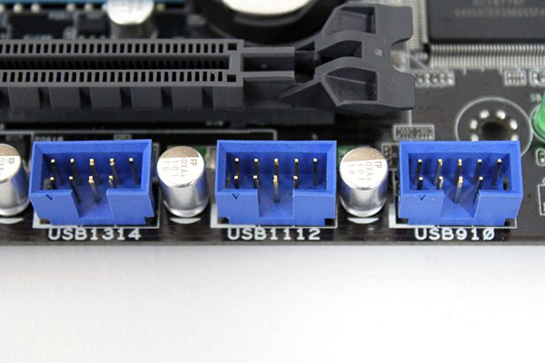

# Índice

**1. Placa base (motherboard): guía exhaustiva 2025 (España)**

- 1.1 Introducción

- 1.2 Factor de forma (form factor)

- 1.3 Socket (zócalo de CPU)
  - 1.3.1 Intel (sobremesa y workstation recientes)
  - 1.3.2 AMD (sobremesa y HEDT recientes)

- 1.4 Chipset (PCH)
  - 1.4.1 Intel (consumo)
  - 1.4.2 AMD (AM5)

- 1.5 VRM y alimentación

- 1.6 Bancos de memoria (DIMM)

- 1.7 Ranuras PCI Express

- 1.8 Almacenamiento: M.2 y SATA
  - 1.8.1 Zócalos M.2
  - 1.8.2 Puertos SATA

- 1.9 Puertos traseros e internos (headers)

- 1.10 Firmware UEFI (BIOS moderna)

- 1.11 Sensores y diagnóstico

- 1.12 Diseño del PCB y calidad

- 1.13 Selección rápida según uso

- 1.14 Listados de referencia (2024–2025)
  - 1.14.1 Chipsets destacados
  - 1.14.2 Sockets más relevantes

- 1.15 Checklist de montaje y verificación

---

## 1.1 Introducción

[Contenido de introducción]

## 1.2 Factor de forma (form factor)

[Contenido sobre factores de forma]

## 1.3 Socket (zócalo de CPU)

[Contenido sobre sockets]

### 1.3.1 Intel (sobremesa y workstation recientes)

[Contenido Intel]

### 1.3.2 AMD (sobremesa y HEDT recientes)

[Contenido AMD]

## 1.4 Chipset (PCH)

[Contenido sobre chipsets]

### 1.4.1 Intel (consumo)

[Contenido Intel chipsets]

### 1.4.2 AMD (AM5)

[Contenido AMD chipsets]

## 1.5 VRM y alimentación

[Contenido sobre VRM y alimentación]

## 1.6 Bancos de memoria (DIMM)

[Contenido sobre bancos de memoria]

## 1.7 Ranuras PCI Express

[Contenido sobre ranuras PCI Express]

## 1.8 Almacenamiento: M.2 y SATA

[Contenido sobre almacenamiento]

### 1.8.1 Zócalos M.2

[Contenido M.2]

### 1.8.2 Puertos SATA

[Contenido SATA]

## 1.9 Puertos traseros e internos (headers)

[Contenido sobre puertos e internos]

## 1.10 Firmware UEFI (BIOS moderna)

[Contenido sobre UEFI]

## 1.11 Sensores y diagnóstico

[Contenido sobre sensores]

## 1.12 Diseño del PCB y calidad

[Contenido sobre diseño PCB]

## 1.13 Selección rápida según uso

[Contenido sobre selección]

## 1.14 Listados de referencia (2024–2025)

[Contenido listados]

### 1.14.1 Chipsets destacados

[Contenido chipsets destacados]

### 1.14.2 Sockets más relevantes

[Contenido sockets relevantes]

## 1.15 Checklist de montaje y verificación

[Contenido checklist]
