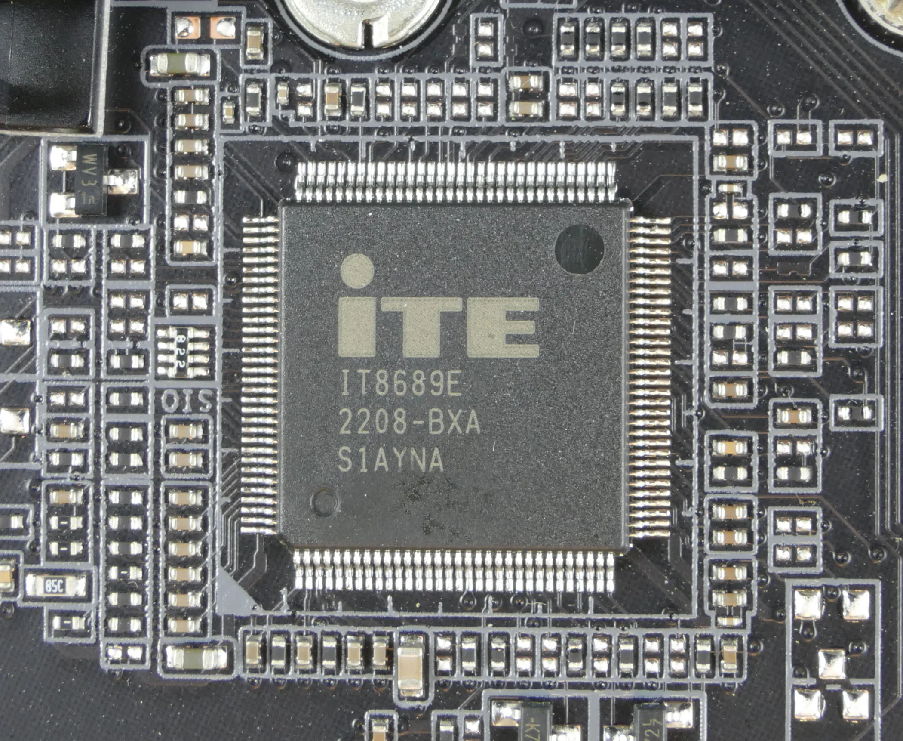
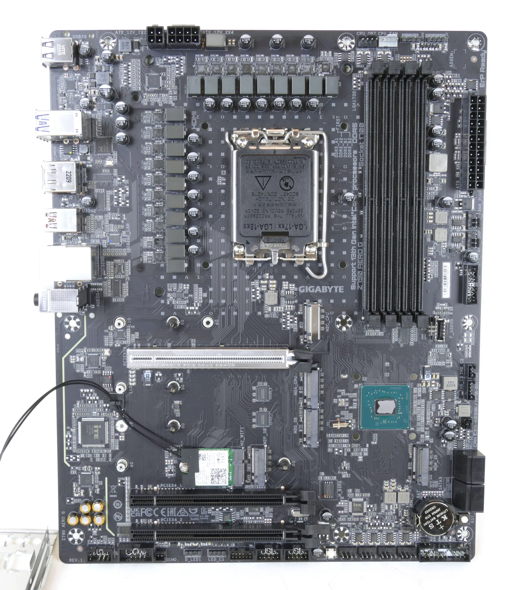

## TEMA 6. CMOS

1. [Introducción a la memoria CMOS](#1-introducción-a-la-memoria-cmos)
2. [Tecnología CMOS](#2-tecnología-cmos)
3. [Ubicación física y alimentación de la CMOS](#3-ubicación-física-y-alimentación-de-la-cmos)
4. [Uso de la memoria CMOS en un PC](#4-uso-de-la-memoria-cmos-en-un-pc)
5. [Reseteo y restauración de la CMOS](#5-reseteo-y-restauración-de-la-cmos)
6. [Problemas y mantenimiento de la CMOS](#6-problemas-y-mantenimiento-de-la-cmos) 

## 1. Introducción a la memoria CMOS
#  Vocabulario

| Término          | Definición                                                                                     |
|------------------|------------------------------------------------------------------------------------------------|
| CMOS             | Complementary Metal-Oxide-Semiconductor; tecnología de bajo consumo usada en chips de memoria y circuitos electrónicos en PC.         |
| Memoria CMOS     | Pequeña memoria RAM volátil que almacena la configuración del sistema, como hora, fecha y ajustes de BIOS, alimentada por una pila.    |
| Batería CMOS     | Pila (normalmente CR2032) de la placa base que suministra energía para mantener la memoria CMOS activa cuando el PC está apagado.       |
| BIOS             | Firmware almacenado en memoria ROM que inicializa y prueba el hardware del PC, usando datos guardados en la memoria CMOS.               |
| Reseteo CMOS     | Proceso de borrar la configuración guardada en CMOS para restaurar valores por defecto, mediante botón, puente de pines o extracción de pila. |
| Configuración BIOS| Ajustes almacenados en la memoria CMOS que controlan hardware, secuencia de arranque, contraseñas y otras opciones de sistema.            |

### Definición y conceptos clave

La memoria CMOS (Complementary Metal-Oxide-Semiconductor) es un tipo de memoria RAM de bajo consumo utilizada en las placas base de los PCs para almacenar la configuración del sistema, incluyendo parámetros como la fecha y hora, el orden de arranque, contraseñas y configuraciones de hardware esenciales. Esta memoria es volátil y requiere energía constante suministrada por una batería, comúnmente una pila tipo botón CR2032, que permite conservar los datos cuando el PC está apagado. A diferencia del BIOS, que es el firmware almacenado en memoria ROM, la memoria CMOS almacena los valores modificables por el usuario que son usados por el BIOS durante el arranque del sistema para configurar el hardware y el sistema operativo. Un fallo o pérdida de energía en esta batería provoca que la configuración CMOS se resetee, lo que puede generar errores al arrancar el equipo.

### Breve historia de la tecnología CMOS en PCs

La tecnología CMOS se comenzó a usar ampliamente en PCs desde finales de los años 70 y principios de los 80 como una solución más eficiente energéticamente para mantener la configuración del sistema sin necesidad de fuentes externas o recargas frecuentes, a diferencia de las tecnologías previas como baterías recargables internas. A medida que las placas base y el firmware BIOS evolucionaban, la memoria CMOS se convirtió en un componente estándar para almacenar las configuraciones personalizadas del usuario y facilitar la funcionalidad del sistema. Con el paso del tiempo, el CMOS continuó utilizándose por su bajo consumo y alta fiabilidad, aunque muchas funciones han ido integrándose con tecnologías más modernas como la memoria flash para BIOS/UEFI, que permite actualizar el firmware sin perder la configuración almacenada.

Este equilibrio entre persistencia de configuraciones y eficiencia energética hace que la memoria CMOS siga siendo un elemento clave en el diseño y mantenimiento de PCs modernos.  

---

  

---

## 2. Tecnología CMOS

### Funciones principales y características

La memoria CMOS es un chip de bajo consumo energético presente en la mayoría de placas base de PCs, encargado de almacenar información esencial del sistema, como la configuración del BIOS, fecha, hora, secuencia de arranque, contraseñas y parámetros de hardware. Esta memoria es volátil, por lo que requiere una batería (normalmente una pila CR2032) que le suministre energía aún cuando el PC está apagado. Su función principal es conservar la configuración del sistema para que al encender el equipo, éste pueda arrancar con los ajustes definidos y reconocer el hardware conectado. La tecnología CMOS destaca por su bajo consumo, alta fiabilidad y capacidad para mantener la información crítica sin requerir una fuente de energía principal.

### Comparación con otros tipos de memoria (RAM y ROM)

- **RAM:** La memoria RAM es volátil y se utiliza para almacenar datos y programas en ejecución; al apagar el PC, su contenido se pierde totalmente. La CMOS también es volátil, pero su función es mantener configuraciones específicas mediante alimentación de batería.
- **ROM:** La memoria ROM almacena firmware, como el BIOS o UEFI, de forma permanente y no se borra al apagar el equipo. La CMOS, en cambio, almacena datos modificables por el usuario que afectan el arranque y configuración del sistema.
- La CMOS es más permanente que la RAM para configuraciones, pero menos que la ROM, ya que depende de la pila para mantener su contenido.

### Relación entre CMOS, BIOS y UEFI

**El BIOS (Basic Input Output System) o su sucesor UEFI, son firmware almacenados en memoria no volátil (ROM/Flash) que controlan el proceso de arranque del PC y la inicialización del hardware.** El CMOS almacena los parámetros de configuración que el BIOS/UEFI utiliza durante el arranque para saber cómo debe configurarse el sistema, como el orden de dispositivos de arranque, la hora, y las opciones de seguridad. Aunque CMOS y BIOS trabajan estrechamente, son componentes diferentes: la CMOS solo guarda la configuración, mientras que el BIOS/UEFI ejecuta las instrucciones necesarias para el inicio del sistema.

Esta relación permite modificar configuraciones persistentes sin alterar el firmware y facilita la gestión del hardware y la personalización del arranque del sistema. En sistemas modernos, muchas funciones tradicionales de la CMOS están siendo transferidas al firmware UEFI, pero su principio y función básica se mantienen.

## 3. Ubicación física y alimentación de la CMOS

### Chip y pila en la placa base: tipos y vida útil

La memoria CMOS está contenida en un chip específico dentro de la placa base del PC. Tradicionalmente, esta memoria se encuentra cerca de la batería que la alimenta, y es identificable como un pequeño chip de memoria RAM volátil de bajo consumo. La CMOS depende de una batería interna para mantener los datos almacenados cuando el equipo está apagado.

La batería más común es el modelo de pila de botón tipo CR2032 de 3V, ubicada generalmente en un soporte visible en la placa base, frecuentemente cerca de las ranuras de expansión o en la parte inferior de la placa. La vida útil típica de esta batería oscila entre 3 y 10 años, dependiendo del uso del PC y la calidad de la batería. Cuando esta pila se agota, la memoria CMOS pierde alimentación y con ella la configuración guardada, lo que provoca que el PC pueda perder la fecha, hora y los ajustes del BIOS, además de dificultar o impedir el arranque correcto del sistema.

---

  

---

En placas Z790 la “CMOS” no es un chip aparte: el RTC/CMOS está integrado en el PCH (chipset Intel Z790) y los ajustes de UEFI se guardan en la flash SPI. En la foto (Gigabyte Z790 AERO G, con el disipador quitado) la CMOS/RTC reside en el PCH.

### Papel de la batería CR2032

Esta pila CR2032 es fundamental para el funcionamiento continuo de la memoria CMOS, pues suministra la energía necesaria para que la configuración del sistema se mantenga activa y no se borre al apagar el PC. Es una batería de litio con capacidad suficiente para alimentar la memoria durante años en condiciones normales. Cuando la batería comienza a fallar, es habitual notar mensajes de error al encender el PC, como advertencias relacionadas con la fecha y hora, o la imposibilidad de almacenar los parámetros de configuración.

El reemplazo de la batería CR2032 es sencillo, generalmente solo es necesario liberar un pequeño clip o pestillo que la sujeta y colocar una nueva batería del mismo tipo respetando la polaridad indicada. Es recomendable realizar este cambio con el equipo apagado y desconectado para evitar daños.

Mantener esta batería en buen estado es crucial para evitar problemas de configuración y garantizar un arranque estable y confiable del PC.

---

  

---

