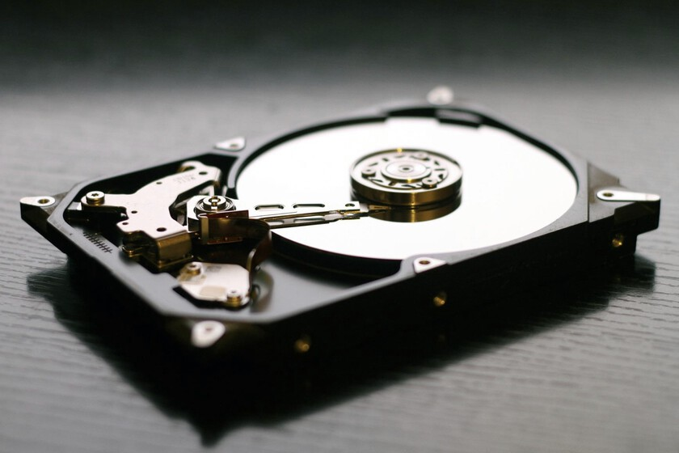
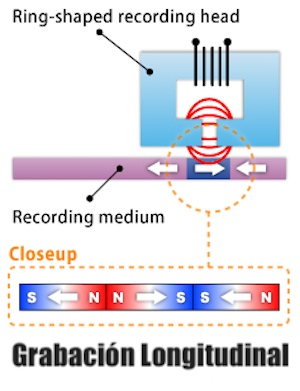
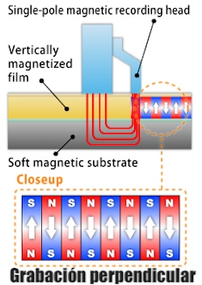

# Índice de Dispositivos de almacenamiento
# Índice de Dispositivos de almacenamiento

- [1. Introducción a los dispositivos de almacenamiento](#1-introducción-a-los-dispositivos-de-almacenamiento)
  - [1.1 Definición y tipos principales](#11-definición-y-tipos-principales)
  - [1.2 Importancia en la informática actual](#12-importancia-en-la-informática-actual)

- [2. Tecnologías tradicionales de almacenamiento](#2-tecnologías-tradicionales-de-almacenamiento)
  - [2.1 HDD (Discos Duros)](#21-hdd-discos-duros)
  - [2.2 SSD (Unidades de Estado Sólido)](#22-ssd-unidades-de-estado-sólido)
  - [2.3 Memorias Flash y USB](#23-memorias-flash-y-usb)
  - [2.4 Tecnología óptica: CD y DVD](#24-tecnología-óptica-cd-y-dvd)

- [3. Últimas tecnologías en almacenamiento de 2025](#3-últimas-tecnologías-en-almacenamiento-de-2025)
  - [3.1 Tecnología SMR (Grabación Magnética Escalonada) en HDD](#31-tecnología-smr-grabación-magnética-escalonada-en-hdd)
  - [3.2 Sistemas NVMe all-flash de alta capacidad y velocidad](#32-sistemas-nvme-all-flash-de-alta-capacidad-y-velocidad)
  - [3.3 Almacenamiento descentralizado basado en Blockchain](#33-almacenamiento-descentralizado-basado-en-blockchain)
  - [3.4 Soluciones inteligentes con Inteligencia Artificial](#34-soluciones-inteligentes-con-inteligencia-artificial)
  - [3.5 Unidades SSD con velocidades avanzadas (hasta 60 GB/s)](#35-unidades-ssd-con-velocidades-avanzadas-hasta-60-gbs)
  - [3.6 Integraciones híbridas y almacenamiento en la nube híbrida](#36-integraciones-híbridas-y-almacenamiento-en-la-nube-híbrida)

- [4. Innovaciones emergentes](#4-innovaciones-emergentes)
  - [4.1 Almacenamiento en ADN](#41-almacenamiento-en-adn)
  - [4.2 Inteligencia Artificial para predicción y optimización](#42-inteligencia-artificial-para-predicción-y-optimizacion)
  - [4.3 Tolerancia a fallos y mayor seguridad mediante blockchain](#43-tolerancia-a-fallos-y-mayor-seguridad-mediante-blockchain)
  - [4.4 Almacenamiento adaptativo y flexible para entornos empresariales](#44-almacenamiento-adaptativo-y-flexible-para-entornos-empresariales)

- [5. Tendencias del mercado y perspectivas futuras](#5-tendencias-del-mercado-y-perspectivas-futuras)
  - [5.1 Aumento de capacidades (terabytes y petabytes)](#51-aumento-de-capacidades-terabytes-y-petabytes)
  - [5.2 Optimización en consumo energético y sostenibilidad](#52-optimización-en-consumo-energético-y-sostenibilidad)
  - [5.3 Automatización y robótica en centros de datos](#53-automatización-y-robótica-en-centros-de-datos)
  - [5.4 Mayor integración con tecnologías de Big Data e IoT](#54-mayor-integración-con-tecnologías-de-big-data-e-iot)

- [6. Conclusiones y recomendaciones para elegir dispositivos](#6-conclusiones-y-recomendaciones-para-elegir-dispositivos)
  - [6.1 Comparativa según uso y necesidades](#61-comparativa-según-uso-y-necesidades)
  - [6.2 Costos y beneficios de las nuevas tecnologías](#62-costos-y-beneficios-de-las-nuevas-tecnologías)

---

# Vocabulario clave — Almacenamiento (SATA, NVMe, M.2…)

| Categoría | Término | Definición breve |
|---|---|---|
| Interfaz/Protocolo | **SATA 3** | Bus para discos/SSD con tope ~600 MB/s; latencia mayor que NVMe. |
| Interfaz/Protocolo | **AHCI** | Protocolo de control para SATA; pensado para HDD, menos eficiente en SSD. |
| Interfaz/Protocolo | **PCI Express (PCIe)** | Bus de alta velocidad por “líneas” (x1/x2/x4/x8/x16). |
| Interfaz/Protocolo | **NVMe** | Protocolo para SSD sobre PCIe con baja latencia y alto paralelismo. |
| Formato físico | **M.2** | Tarjeta delgada (2230/2242/2260/2280/22110); puede ser **SATA** o **NVMe**. |
| Formato físico | **Key M / Key B / B+M** | Muescas de M.2 que indican compatibilidad: M (NVMe x4), B/B+M (SATA o NVMe x2). |
| Formato físico | **2.5"** | Caja fina usada por SSD/HDD SATA (datos + alimentación). |
| Formato físico | **3.5"** | Tamaño típico de HDD de alta capacidad. |
| Formato físico | **U.2** | Formato 2.5" que usa NVMe por cable; común en servidores. |
| Métricas | **Secuencial (MB/s)** | Velocidad al copiar archivos grandes (vídeo/ISO). |
| Métricas | **Aleatorio 4K / IOPS** | Operaciones pequeñas por segundo; clave para SO y apps. |
| Métricas | **Latencia** | Tiempo por operación; cuanto menor, más “ágil” se percibe. |
| Métricas | **4K Q1T1** | Prueba de lectura/escritura aleatoria 4 KiB, cola 1; muy representativa de uso real. |
| Componentes SSD | **Controlador** | “Cerebro” del SSD: gestiona colas, cachés, wear-leveling. |
| Componentes SSD | **DRAM (en SSD)** | Caché rápida para mapear direcciones; mejora estabilidad y rendimiento. |
| Componentes SSD | **DRAMless / HMB** | SSD sin DRAM propia; puede usar RAM del host (HMB) pero rinde menos en carga. |
| NAND | **SLC / MLC / TLC / QLC** | Tipos de celdas: de más rápida/durable (SLC) a más densa/barata (QLC). |
| Resistencia | **TBW / DWPD** | Terabytes escritos / escrituras por día; estiman vida útil de un SSD. |
| Mantenimiento | **TRIM** | El SO marca bloques libres para que el SSD optimice futuras escrituras. |
| Mantenimiento | **Garbage Collection** | Limpieza/compactación interna de bloques en el SSD. |
| Mantenimiento | **S.M.A.R.T.** | Indicadores de salud (temperatura, errores, desgaste). |
| Térmica | **Throttling** | El SSD se frena por temperatura alta para protegerse. |
| Térmica | **Disipador M.2** | Placa/“heatsink” que ayuda a mantener rendimiento sostenido. |
| Placa base | **Líneas PCIe (lanes)** | Canales de datos; un NVMe suele usar **x4**. |
| Placa base | **CPU vs Chipset** | Origen de las líneas: desde **CPU** (mejor) o desde **chipset** (más contención). |
| Placa base | **Bifurcación x16→x8/x8** | Reparto de líneas de la ranura de GPU al poblar otros dispositivos. |
| Placa base | **Deshabilitación SATA** | Al usar ciertos M.2, algunos puertos SATA pueden apagarse (ver manual). |
| Arranque | **UEFI / BIOS (Legacy)** | Firmware moderno (UEFI) vs legado (BIOS); UEFI soporta NVMe nativo. |
| Particionado | **GPT / MBR** | Esquemas de particiones: GPT (moderno, >2 TB), MBR (legado). |
| Seguridad | **Cifrado en reposo** | Protección de datos en disco (BitLocker, LUKS, FileVault). |
| Copias | **Regla 3-2-1** | 3 copias, 2 medios, 1 fuera de ubicación (backup real). |
| Copias | **RAID ≠ Backup** | RAID da disponibilidad; **no** sustituye a las copias de seguridad. |

---

# 1. Introducción a los dispositivos de almacenamiento

Los **dispositivos de almacenamiento** guardan datos de forma **persistente** (no se pierden al apagar). Son la base para instalar el **sistema operativo**, aplicaciones y mantener **archivos** (documentos, fotos, bases de datos…). Se diferencian de la **memoria** (RAM), que es **volátil** y mucho más rápida, pero se borra al apagar.

### Ideas clave
- **Persistencia**: conservan los datos sin energía.
- **Velocidad vs capacidad vs precio**: no existe el “mejor absoluto”; se elige por **equilibrio** (rendimiento/coste/fiabilidad).
- **Interfaz ≠ formato**: “cómo habla” (SATA, NVMe/PCIe, USB…) no es lo mismo que “la forma física” (M.2, 2.5”, 3.5”).
- **Capas de la jerarquía**: CPU/cache → RAM → **almacenamiento** (SSD/HDD/tape). Cuanto más cerca de la CPU, más rápido y caro; cuanto más lejos, más lento y barato.

### Métricas que debes saber
- **Capacidad**: GB/TB (1 TB ≈ 1000 GB).
- **Rendimiento**:
  - **Secuencial (MB/s)**: copiar archivos grandes.
  - **Aleatorio (IOPS/latencia)**: abrir apps, cargar páginas, BBDD (lo que “se siente rápido”).
  - **Latencia**: tiempo por operación (ms/µs). **Menos es mejor**.
- **Resistencia** (SSD): **TBW/DWPD** (cuánto puedes escribir sin agotar el disco).
- **Fiabilidad**: tasas de error, **SMART**, **MTBF**; copias/RAID/redundancia están para **mitigar** fallos, no para evitarlos por completo.

---

## 1.1 Definición y tipos principales

### Definición
Dispositivo capaz de **registrar**, **conservar** y **recuperar** información digital. La mayoría son **no volátiles** (siguen guardando datos sin energía).

### Tipos por **tecnología**
- **HDD (magnéticos)**  
  Platos giratorios + cabezales.  
  - **Pros**: **muchos TB** a bajo coste/GB.  
  - **Contras**: más **lentos** (alta latencia), sensibles a golpes, consumo y ruido.  
  - Conceptos: **RPM** (5400/7200/10000), **tiempo de búsqueda**, **SMR vs CMR** (SMR más denso pero peor en escrituras sostenidas).
- **SSD (estado sólido, NAND)**  
  Chips NAND + controlador (sin partes móviles).  
  - **Pros**: **baja latencia**, gran rendimiento aleatorio, silenciosos, menor consumo.  
  - **Contras**: más **caros/GB**, **desgaste** (mitigado con wear-leveling).  
  - Conceptos: **TLC/QLC** (densidad vs rendimiento), **DRAM vs DRAMless (HMB)**, **TRIM** y **garbage collection**.
- **Ópticos (CD/DVD/BD)**  
  Lectura láser. Uso hoy: archivado puntual, distribución antigua de software.
- **Cinta magnética (LTO)**  
  Muy alta capacidad y bajo coste por TB para **archivos y copias** a largo plazo (empresas).
- **Flash extraíble** (USB, **SD/microSD**)  
  Portabilidad; rendimiento y fiabilidad **muy variables** según gama.

### Tipos por **interfaz/protocolo**
- **SATA + AHCI**: clásico de HDD/SSD 2.5”; límite práctico ~600 MB/s, latencia mayor.  
- **NVMe sobre PCIe (x2/x4)**: protocolo moderno para SSD; **GB/s** y baja latencia. Puede ir en **M.2**, **U.2** o tarjetas PCIe.  
- **USB/Thunderbolt** (externo): discos y SSD portátiles; el rendimiento depende del estándar (USB 3.x, TB3/4).  
- **SAS** (servidor): similar a SATA pero más robusto y con doble puerto para redundancia.

### Tipos por **formato físico**
- **3.5"**: HDD de gran capacidad (sobremesa/servidor).  
- **2.5"**: SSD/HDD compactos (portátiles/servidores).  
- **M.2** (2230/2242/2260/2280/22110): **formato** de tarjeta; puede ser **SATA o NVMe** (ojo a las **keys**: **M**, **B**, **B+M**).  
- **U.2**: 2.5" con conector para **NVMe** por cable (entornos profesionales).  
- **mSATA** (legado): antecesor del M.2.

> **Regla de oro**: “la **placa manda**”. Revisa en el **manual** de la placa qué acepta cada zócalo: **NVMe**, **SATA** o **ambos**, y qué **puertos SATA** se desactivan cuando pueblas ciertos **M.2**.

---

## 1.2 Importancia en la informática actual

### 1) Rendimiento percibido por el usuario
- El salto **HDD → SSD** reduce drásticamente **latencias**: el sistema **arranca** más rápido, las apps se **abren** antes y la multitarea mejora.  
- Entre **SSD SATA** y **SSD NVMe**, la mejora visible aparece en tareas **aleatorias** o con **mucha concurrencia** (proyectos grandes, BBDD, VMs).

### 2) Productividad del desarrollador y del aula
- Compilaciones, instalación de dependencias, contenedores, VMs y bases de datos **leen/escriben miles de ficheros pequeños**. Aquí NVMe brilla (IOPS/latencia).  
- En aulas y talleres, un buen SSD reduce tiempos muertos y **aumenta el tiempo efectivo de práctica**.

### 3) Datos, copias y recuperación
- El almacenamiento es donde “**vive**” la información: sin copias, **se pierde**.  
- Estrategia mínima: **3–2–1** (3 copias, 2 medios, 1 fuera de ubicación).  
- **RAID ≠ backup**: RAID aporta disponibilidad; el **backup** protege de borrados, ransomware o corrupción.

### 4) Seguridad y cumplimiento
- **Cifrado en reposo**: BitLocker, LUKS, FileVault. Imprescindible en portátiles con datos sensibles.  
- **Borrado seguro**: `secure erase`, destrucción física cuando procede.  
- **SMART/monitorización**: anticipa fallos, planifica reemplazos.

---

## 2. Tecnologías tradicionales de almacenamiento

En este bloque vas a entender **cómo guardan los datos** los soportes “clásicos” que todavía encuentras en PCs, portátiles y laboratorios: **HDD** (discos duros mecánicos), **SSD** (estado sólido), **memorias flash/USB** y **ópticos** (CD/DVD). No es solo “cuánto caben” o “cuántos MB/s dicen”; el **cómo funcionan por dentro** explica **por qué rinden** como rinden, **cuándo elegir** cada uno y **qué precauciones** tomar.

### Qué importa de verdad (mapa mental rápido)
- **Persistencia**: conservan los datos sin energía (a diferencia de la RAM).
- **Patrón de acceso**:  
  - *Secuencial* (copiar vídeos/ISOs) → importa el **ancho** (MB/s).  
  - *Aleatorio* (abrir apps/OS, compilar, BBDD) → manda la **latencia/IOPS**.
- **Tecnología interna**:
  - **HDD (mecánico + magnético)** → cabezal se mueve + disco gira → **latencia alta** en aleatorio.
  - **SSD/Flash (electrónico + NAND)** → sin partes móviles → **latencia muy baja**, gestión interna (FTL, TRIM).
  - **Óptico (láser + pits/lands)** → lectura secuencial, **lento** pero barato para distribución/archivo puntual.
- **Interfaz ≠ Formato**:
  - **SATA/AHCI** vs **NVMe/PCIe** (protocolo/interfaz).  
  - **2.5"**, **M.2**, **3.5"**, **U.2** (forma física).  
  - Un **M.2** puede ser **SATA** *o* **NVMe**: la **placa manda** (compatibilidad).
- **Coste/GB y resistencia**:
  - HDD → **muy barato/GB**, muchos TB.  
  - SSD SATA → equilibrio precio/rendimiento.  
  - SSD NVMe → **máximo rendimiento** (sobre todo en aleatorio).  
  - Flash/USB → portable, calidad muy variable.  
  - Métricas SSD: **TBW/DWPD**, **temperatura** y **throttling**.
- **Fiabilidad y mantenimiento**: **SMART**, **TRIM**, copias **3-2-1**, y recordar que **RAID ≠ backup**.

### Reglas rápidas de elección 
- **SO + apps / desarrollo / VMs** → **SSD NVMe** si la placa lo permite.  
- **Equipo antiguo o presupuesto ajustado** → **SSD SATA** (gran salto respecto a HDD).  
- **Muchos TB baratos** (multimedia, copias) → **HDD**.  
- **Transporte** / cámaras → **USB/SD** (elige bien por normas A1/A2, V30+ si grabas vídeo).  
- **Distribución/archivo puntual** → **óptico** o **cloud** económico.

---
## 2.1 HDD (Discos Duros)

### 1) Visión general
Un **HDD** almacena datos usando **magnetismo** sobre **platos** que **giran** a alta velocidad. Un **brazo actuador** posiciona un **cabezal** a micras de la superficie para **escribir** (magnetizar dominios) y **leer** (medir variaciones de campo). Al ser un sistema **mecánico + magnético**, su **latencia** es mucho mayor que la de un SSD, especialmente en accesos **aleatorios**.

---

  

---

### 2) Componentes y mecánica
- **Platos (platters)**: discos recubiertos de material magnético; cada **cara** tiene un cabezal propio.  
- **Spindle + RPM**: motor que hace girar los platos (p. ej., **5400/7200/10.000 RPM**).  
- **Brazo actuador (voice-coil)**: mueve todos los cabezales a la vez radialmente.  
- **Cabezales MR/TMR**: sensores magnetorresistivos para lectura y elementos de escritura.  
- **Preamplificador** (en el conjunto de cabezales) y **controlador** (en la PCB).  
- **Filtros** y **carcasa sellada**: el aire interno aporta el “colchón” de vuelo del cabezal.

**Tiempos fundamentales**
- **Seek** (búsqueda): movimiento del brazo hasta la pista deseada.  
- **Latencia rotacional**: lo que tarda en **pasar el sector** bajo el cabezal.  
- **Transferencia**: lectura/escritura una vez alineado el sector.

> **Latencia rotacional media** ≈ ½ vuelta = `0,5 × 60 / RPM` segundos  
> En **7200 RPM** ≈ `0,5 × 60/7200 × 1000` = **~4,17 ms**.

---

### 3) Lectura y escritura magnética (cómo “nacen” los bits)
- **Escritura**: una bobina en el cabezal genera un campo que **orienta dominios** magnéticos (0/1) en la capa del plato.  
- **Lectura**: el paso por un dominio provoca una **pequeña variación** de campo que el elemento **MR/TMR** convierte en señal eléctrica.  
- **Procesado de señal**: técnicas modernas (**PRML/LDPC**, etc.) permiten recuperar datos con densidades muy altas tolerando ruido.  
- **Servo**: la posición fina del cabezal se corrige leyendo **marcas de servo** grabadas a lo largo de los platos (mantiene el “seguimiento de pista”).

---

  

---

  

---

> ESTRUCTURA LOGICA HDD

---

  

---

### 4) Organización física y lógica de los datos
**4.1 De lo físico a lo lógico**
- **Pistas**: circunferencias concéntricas en cada cara.  
- **Sectores**: porciones dentro de la pista (típicamente **512 B** o **4096 B** de **datos útiles**).  
- **Cilindro**: conjunto de pistas a la misma “altura” en **todas las caras** (todos los cabezales).

**4.2 ZBR (Zoned Bit Recording)**
- Las pistas **externas** son más largas (mayor perímetro) ⇒ pueden almacenar **más sectores por vuelta**.  
- El disco se divide en **zonas**; cada zona tiene un número fijo de sectores por pista.  
- Resultado: el **rendimiento secuencial** es **mayor** en las zonas **externas** que en las **internas**.

> Dónde poner imagen 3 (ZBR: zonas externas vs internas):  
> ``  
> *Figura 2.3 — Zoned Bit Recording: más sectores por pista en la periferia.*

**4.3 CHS vs LBA**
- **CHS** (Cylinder-Head-Sector): direccionamiento antiguo (geometría “ficticia” hacia el SO).  
- **LBA** (Logical Block Addressing): hoy se **abstrae** todo como bloques lineales numerados (**0..N**). El firmware traduce **LBA → zona/pista/sector** reales.

**4.4 Advanced Format (512e / 4Kn)**
- Físicamente muchos HDD usan **sectores de 4096 B** (**4K**).  
- **512e** (512 emulado): presentan 512 B lógicos para compatibilidad, empaquetados en **4K físicos** → importante **alinear particiones a 4K**.  
- **4Kn**: exponen **4096 B** lógicos y físicos.

**4.5 Estructura de un sector (simplificada)**
- **Datos de usuario** (512 B o 4096 B) + **metadatos** (cabeceras, sincronización) + **ECC**.  
- El **ECC** corrige errores de lectura **sin** intervención del usuario.

---

### 5) Rendimiento: por qué un HDD “se siente” lento en aleatorio
- **Accesos secuenciales**: el cabezal **no salta** de pista → solo cuenta latencia rotacional + transferencia ⇒ **MB/s decentes**.  
- **Accesos aleatorios**: múltiples **seeks** + rotaciones ⇒ **tiempos de espera** constantes en cada operación ⇒ **IOPS muy bajos**.

**Métricas típicas**
- **Tiempo de acceso** (seek + rotacional) en **ms**.  
- **Velocidad secuencial** (MB/s), mayor en **zonas externas**.  
- **NCQ (Native Command Queuing)** en SATA: reordena peticiones para **reducir movimientos** del cabezal (mejora multiusuario).

> Regla práctica: si tu carga son **muchos ficheros pequeños** (SO, apps, compilaciones), un HDD sufrirá; un SSD **vuela**.

---

### 6) Modos de grabación y densidad
- **PMR/CMR (Conventional Magnetic Recording)**: pistas “normales”. Buen rendimiento **general**.  
- **SMR (Shingled Magnetic Recording)**: pistas **solapadas** como tejas; **más densidad**, pero **reescrituras** implican mover datos de una “banda” ⇒ **mal** para cargas de **escritura aleatoria** sostenida (salvo con caché y gestión cuidadosa).  
- **HAMR/MAMR** (nuevas técnicas): calentar/ayudar la grabación para **aumentar densidad** (usado en modelos de gran capacidad).  
- **Helio**: discos llenos de **helio** reducen fricción y permiten **más platos** con menor consumo/vibración.

---

### 7) Fiabilidad, corrección y gestión de defectos
- En fábrica se crea una **P-list** (defectos de fabricación) y durante la vida del disco una **G-list** (defectos “crecidos”).  
- Cuando un sector se degrada, el firmware lo **remapea** a un **repuesto** (spare) transparente para el sistema.  
- **S.M.A.R.T.**: monitoriza salud (atributos importantes:  
  **5** Reallocated Sectors, **197** Current Pending Sector, **198** Uncorrectable, **194** Temperatura, **9** Power-On Hours, **193** Load/Unload Cycle).  
- En entornos RAID, funciones tipo **TLER/ERC** limitan el tiempo de recuperación para no “expulsar” discos por tardar demasiado en reparar un sector.

---

### 8) Sistema de ficheros y fragmentación
- Un **cluster** del sistema de archivos agrupa sectores (p. ej., 4 KiB).  
- En HDD, la **fragmentación** dispersa clusters de un mismo fichero ⇒ **más seeks** ⇒ **peor** rendimiento.  
- **Desfragmentar** puede **mejorar** (solo HDD). **No** desfragmentes SSD.  
- Importa la **alineación a 4K** en discos **512e/4Kn** para evitar lecturas-modificaciones-reescrituras innecesarias.

---

### 9) Buenas prácticas de uso y montaje
- **Evita golpes** y vibraciones; no muevas el equipo con el disco en acceso.  
- **Fija** el HDD con tornillos y, si hay varios, usa bahías anti-vibración.  
- **Ventilación**: mantener temperatura moderada.  
- **Backups**: los fallos pueden ser bruscos (mecánica).  
- Elige **CMR** para cargas de **escritura** exigentes; **SMR** solo para archivo/lectura.  
- Para **rendimiento**: usa **NCQ**, evita fragmentación y coloca datos secuenciales en la **zona externa** si el software lo permite (algunas herramientas de clonación/particionado).

---

### 10) Resumen comparativo (HDD vs SSD, enfoque rendimiento)
- **HDD**: mecánico; **seek + rotación** = cuello de botella; **barato/GB** y **muchos TB**; ideal para **almacenamiento masivo**.  
- **SSD**: electrónico; **latencia muy baja** y alto **IOPS**; mejor para **SO, apps, BBDD, VMs**.

> Dónde poner imagen 4 (comparativa tiempos):  
> ``  
> *Figura 2.4 — En aleatorio, los seeks y la rotación dominan el tiempo total.*

---

