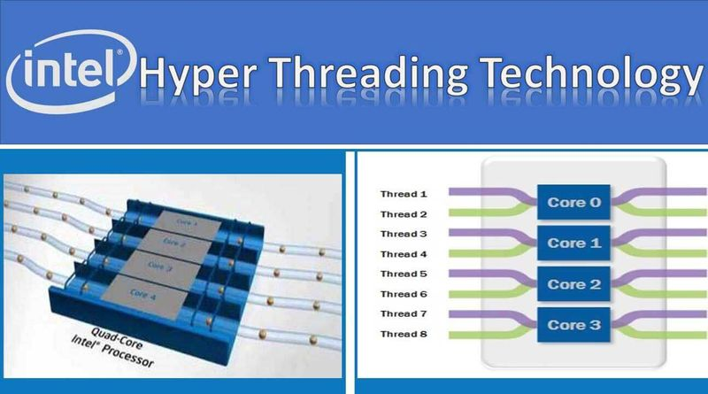

# Procesos e hilos: relación con el procesador

## Índice

1. [Introducción](#1-introducción)  
2. [Qué es un proceso](#2-qué-es-un-proceso)  
3. [Estados de un proceso](#3-estados-de-un-proceso)  
4. [Multitarea y planificación](#4-multitarea-y-planificación)  
5. [Qué es un hilo (thread)](#5-qué-es-un-hilo-thread)  
6. [Diferencias entre procesos e hilos](#6-diferencias-entre-procesos-e-hilos)  
7. [Concurrencia y paralelismo](#7-concurrencia-y-paralelismo)  
8. [Relación entre procesos, hilos y el procesador](#8-relación-entre-procesos-hilos-y-el-procesador)  
9. [Cambio de contexto](#9-cambio-de-contexto)  
10. [Hyper-Threading / SMT](#10-hyper-threading--smt)  
11. [Problemas y consideraciones en sistemas multihilo](#11-problemas-y-consideraciones-en-sistemas-multihilo)  
12. [Importancia para el alumnado](#12-importancia-para-el-alumnado)  
13. [Resumen final](#13-resumen-final)  

---

## 1. Introducción

Los sistemas operativos modernos permiten que un ordenador ejecute **muchos programas aparentemente al mismo tiempo**. Para conseguirlo, no trabajan directamente con los programas, sino con dos conceptos fundamentales: **procesos** e **hilos**.

Además, estos conceptos están **estrechamente ligados al procesador** (CPU), ya que es el hardware quien finalmente ejecuta las instrucciones. Comprender cómo se relacionan procesos, hilos y CPU es esencial para entender la multitarea, el rendimiento y el uso real de los núcleos y hilos del procesador.

---

## 2. Qué es un proceso

Un **proceso** es una **instancia de un programa en ejecución**. Cuando se inicia una aplicación, el sistema operativo crea un proceso para poder ejecutarla.

Un proceso incluye:
- El código del programa.
- Un **espacio de memoria propio**.
- Datos y variables.
- Recursos asignados (archivos, sockets, dispositivos).
- Información de control para el sistema operativo.

Cada proceso está **aislado** del resto, lo que aporta:
- Seguridad.
- Estabilidad.
- Protección frente a errores.

Si un proceso falla, no debería afectar directamente a otros procesos.

---

## 3. Estados de un proceso

Durante su vida, un proceso puede pasar por varios estados:

- **Nuevo (New)**: el proceso se está creando.
- **Listo (Ready)**: preparado para ejecutarse, esperando CPU.
- **En ejecución (Running)**: usando el procesador.
- **Bloqueado (Waiting / Blocked)**: esperando un evento (E/S, red).
- **Terminado (Terminated)**: ha finalizado.

El sistema operativo mueve continuamente los procesos entre estos estados para repartir el tiempo de CPU.

---

  

---

## 4. Multitarea y planificación

La **multitarea** permite que varios procesos avancen de forma concurrente.

El **planificador (scheduler)** del sistema operativo decide:
- Qué proceso o hilo se ejecuta.
- Durante cuánto tiempo.
- En qué núcleo del procesador.

En sistemas:
- **Mononúcleo**: la CPU alterna rápidamente entre procesos.
- **Multinúcleo**: varios procesos o hilos pueden ejecutarse realmente en paralelo.

---

## 5. Qué es un hilo (thread)

Un **hilo (thread)** es la **unidad mínima de ejecución** que el sistema operativo puede planificar.

Un proceso puede contener:
- Un solo hilo (monohilo).
- Varios hilos (multihilo).

Los hilos de un mismo proceso:
- Comparten memoria y recursos.
- Ejecutan el mismo programa.
- Pueden realizar tareas diferentes al mismo tiempo.

Cada hilo tiene su propio:
- Contador de programa.
- Registros.
- Pila de ejecución.

---

  

---

## 6. Diferencias entre procesos e hilos

| Característica | Proceso | Hilo |
|--------------|--------|------|
| Aislamiento | Alto | Bajo |
| Memoria | Propia | Compartida |
| Coste de creación | Alto | Bajo |
| Cambio de contexto | Costoso | Más rápido |
| Comunicación | Compleja | Sencilla |

👉 Un proceso **contiene uno o varios hilos**.

---

## 7. Concurrencia y paralelismo

### 7.1 Concurrencia

La **concurrencia** ocurre cuando varias tareas progresan en el tiempo, aunque no se ejecuten exactamente al mismo instante.

Ejemplo:
- Un solo núcleo alternando entre varios hilos.

---

### 7.2 Paralelismo

El **paralelismo** ocurre cuando varias tareas se ejecutan **simultáneamente**, gracias a:
- Varios núcleos físicos.
- Varios hilos lógicos.

Ejemplo:
- Dos hilos ejecutándose a la vez en dos núcleos distintos.

---

## 8. Relación entre procesos, hilos y el procesador

La CPU **no ejecuta procesos directamente**, sino **hilos**.

Relación jerárquica:
- Un **programa** se convierte en un **proceso**.
- Un **proceso** contiene uno o más **hilos**.
- El **procesador ejecuta hilos** en sus núcleos o hilos lógicos.

El sistema operativo:
- Asigna hilos a núcleos físicos o lógicos.
- Decide cuándo se ejecuta cada hilo.
- Cambia entre hilos para repartir la CPU.

Por ello, cuando se observa el uso del procesador, en realidad se está viendo **la ejecución de hilos**, no de procesos completos.

---

## 9. Cambio de contexto

El **cambio de contexto** es el proceso mediante el cual el sistema operativo **interrumpe la ejecución de un hilo o proceso** y pasa a ejecutar otro.

Durante un cambio de contexto, el sistema operativo:
- Guarda el estado actual (registros, contador de programa).
- Carga el estado del siguiente hilo o proceso.
- Continúa la ejecución desde el punto donde se quedó.

Características del cambio de contexto:
- Es necesario para la multitarea.
- Consume tiempo de CPU.
- No produce trabajo útil (overhead).

Cambios de contexto entre:
- **Hilos del mismo proceso** → más rápidos.
- **Procesos distintos** → más lentos, porque cambia el espacio de memoria.

Un exceso de cambios de contexto puede reducir el rendimiento del sistema.

---

## 10. Hyper-Threading / SMT

**Hyper-Threading** (Intel) y **SMT (Simultaneous Multithreading)** son tecnologías que permiten que **un núcleo físico ejecute más de un hilo al mismo tiempo**.

Funcionamiento básico:
- Un núcleo físico se presenta al sistema operativo como **dos núcleos lógicos**.
- Cada hilo lógico puede ejecutar instrucciones cuando hay recursos disponibles.

Ejemplo:
- CPU de 4 núcleos con Hyper-Threading → 8 hilos lógicos.

Ventajas:
- Mejor aprovechamiento del núcleo.
- Más hilos ejecutándose simultáneamente.
- Mejora del rendimiento en multitarea y aplicaciones multihilo.

Limitaciones:
- No duplica la potencia real.
- Los hilos comparten recursos internos.
- La mejora depende del tipo de software.

Hyper-Threading **no sustituye** a tener más núcleos físicos, pero complementa su funcionamiento.

---

## 11. Problemas y consideraciones en sistemas multihilo

El uso intensivo de procesos e hilos puede generar problemas como:
- **Condiciones de carrera**.
- **Bloqueos (deadlocks)**.
- **Inanición (starvation)**.
- Mayor complejidad de depuración.
- Sobrecarga por cambios de contexto.

Por ello, los sistemas operativos y los programas deben gestionar cuidadosamente los hilos.

---

## 13. Resumen final

- Un **proceso** es un programa en ejecución con memoria propia.
- Un **hilo** es la unidad mínima que ejecuta la CPU.
- El procesador ejecuta **hilos**, no procesos completos.
- El **cambio de contexto** permite la multitarea, pero tiene coste.
- **Hyper-Threading / SMT** mejora el aprovechamiento de los núcleos.
- El rendimiento depende del equilibrio entre procesos, hilos y CPU.

Dominar estos conceptos es clave para comprender el funcionamiento real de los sistemas informáticos modernos.
